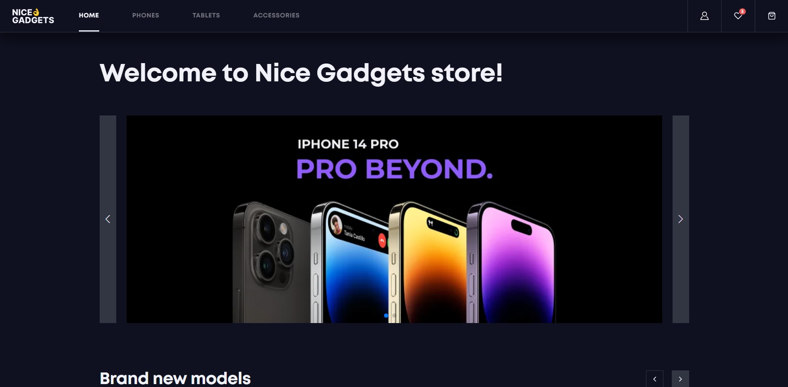

# 💻 Gadgets Store

  

Welcome to the Nice Gadgets Store! This web application is designed to provide users with an interactive platform to browse, search, and purchase various gadgets. Whether you're looking for smartphones, tablets, smartwatches, or other electronic devices, this application has got you covered.

## Features

### Authentication

Users can log in, and securely authenticate themselves to make orders.

### Product Catalog

The application offers a wide range of gadgets of different categories with detailed information such as product descriptions, specifications, pricing, and images.

### Search and Filtering

Users can easily search for specific gadgets by names or apply filtering & sorting options based on price, release date or category.

### Shopping Cart

Users can add products to their shopping cart, view the contents, and manage quantities before proceeding to checkout.

### Favorites

Users can add some products to their wishlist.

### Orders History

All the information about user's orders is saved and it is available on the profile page.

## Preview

[**🔗Click here!**](https://fe-may23-bughunters.github.io/gadgets_store_fe/)

  

## Technologies used

**Frontend**: React, TypeScript, SCSS, Swiper.js, React Loading Skeleton, Axios

[**Backend**](https://github.com/fe-may23-BugHunters/gadgets_store_be): TypeScript, Node.js, Express.js, Sequelize

**Authentication**: [Auth0](https://auth0.com/)

## Installation

1. Clone or fork the repository
2. Create your own `.env` file based on `.env.production` file
3. Run `npm install` or `yarn` in your terminal to download all the packages and dependencies
4. Run `npm run dev` or `yarn run dev` in your terminal to start the development server
5. Enjoy!

## Contributors

👨‍💻 Anatolii Lykhohodenko [@AnatoliiLykhohodenko](https://github.com/AnatoliiLykhohodenko)

👨‍💻 Yevhen Kochetov [@kochetov-yevhen-may29](https://github.com/kochetov-yevhen-may29)

👩‍💻 Ilona Borkovska [@ilona-borkovska](https://github.com/ilona-borkovska) - **Team Lead**

#### 💟 Thank you for your interest in BugHunters!
